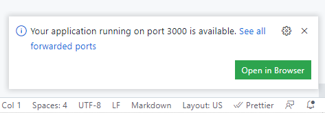
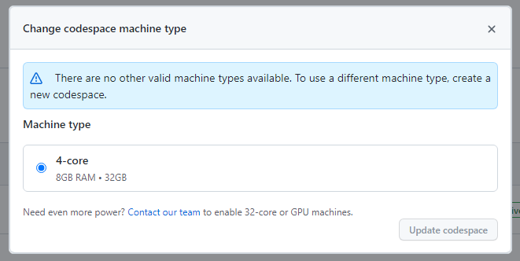

---
# @see https://docusaurus.io/docs/api/plugins/@docusaurus/plugin-content-blog#markdown-front-matter
# Metadata (Recommended) ------------------------------------
title: "GitHub Codespaces やっべぇんですの！というご報告"
date: "2022-06-08"
tags:
  - "日記"
  - "GitHub"
  - "Codespaces"
# draft: true  # if true, the article is `WIP` and therefore should not be published yet
# Allows to customize the blog post url (/<routeBasePath>/<slug>)
# slug: ''   # default is current file path
authors: kiai  # @see authors.yml
# -----------------------------------------------------------
# Additional ------------------------------------------------
# hide_table_of_contents:   # if true, rightside ToC will be invisible
# toc_min_heading_level: 2  # The minimum heading level shown in the ToC
# toc_max_heading_level: 3  # The max heading level shown in the ToC
# for SEO
keywords:
  - "日記"
  - "GitHub"
  - "Codespaces"
# description: '<Desc>'
# for `og:image` and `twitter:image` (.png or .jpg, NOT .svg)
image: https://custom-og-image-generator.vercel.app/api/GitHub%20Codespaces%20%E3%82%84%E3%81%A3%E3%81%B9%E3%81%87%E3%82%93%E3%81%A7%E3%81%99%E3%81%AE%EF%BC%81%F0%9F%92%AF%F0%9F%A6%82%3Cbr%20%2F%3E%E3%81%A8%E3%81%84%E3%81%86%E3%81%94%E5%A0%B1%E5%91%8A.png?theme=light&copyright=Kiai+de+Nantoka&logo=https%3A%2F%2Fgithub.githubassets.com%2Fimages%2Fmona-loading-default-static.svg&avater=https%3A%2F%2Favatars.githubusercontent.com%2Fu%2F20794309&author=Kiai&aka=%40Ningensei848&site=%E6%B0%97%E5%90%88%E3%81%A7%E3%81%AA%E3%82%93%E3%81%A8%E3%81%8B&tags=%E6%97%A5%E8%A8%98&tags=GitHub&tags=Codespaces
---

３月末に申請していた "GitHub Codespaces" のベータ版が今月初旬に到来していた。
[4 月の冒頭](content/blogs/2022/04/01.md)で苦労していたことが嘘のように解決してしまい、今後も手放せないプロダクトとなりそうな予感がある。

早速使ってみた感想を述べる。

<!-- truncate -->

:::caution 追記 2022/06/10 13:15

ブラウザ上で色々とやっている関係で、ウラで JS が頑張っている事情がある。
これを AdBlock 等で止めてしまうと、うまくページが表示されない。

**`github.dev` や `githubpreview.dev` に対してはブロックを実行しない設定に変更する**ことで、JS の邪魔をせずページを表示させることができた。

:::

## すげぇポイントのまとめ

-   port 開放を検出して自動でフォワーディング
-   ローカルブラウザのキャッシュではなく、リモートサーバ側に作業記録が残る

痒いところに手が届かなかった [vscode.dev](https://vscode.dev/) から一転、これらの問題を解決できたことでほぼ VSCode 同然の使い心地となった。

今後リソース調節が可能になれば、単なるデスクトップ版よりもずっと素晴らしいものになるだろう。

## 前提：codespaces ってなに？

https://youtu.be/j5VQ8OlwbqI

> **短時間で構築できる開発環境**
>
> GitHub から離れることなく、Visual Studio Code を利用できます。
>
> Let's join ! ------> [GitHub Codespaces Official Page](https://github.co.jp/features/codespaces)

## 雑な感想

まだ全然カスタムしていないのだが、ほぼ VSCode そのものと言っていい使い心地である。
Chrome 等のブラウザから利用する制約上、多少はショートカットキーが被って意図しない操作をすることがあるが、入力に違和感はないしターミナルも使える。
なんの文句もないだろう。

でもフロント開発をやろうとしたときに、ローカルサーバ立ててポート開けるのは無理よな～～～～と思いつつ何気なく起動してみたところ、なんと特段設定することなくポートフォワーディングを実施してアクセスできた（は？）

codespaces と同様の発想でコミュニティ主導で開発が進められていた [code-server](https://github.com/coder/code-server) においては、ngrok 等の様々な workaround (つまり迂回策)を通じてリモートサーバ上に立てたローカルサーバにフォワーディングしていた（らしい）。
言うまでもなく色々知識と作業が必要で心理的障壁があった印象なのだが、codespaces ではそんなもの一切考えなくてもよい仕組みが整っていた（まじでどういう実装なんや？？？？）

codespaces とは別に、直接 repository を開いて編集できる vscode.dev という仕組みがすでにあり、こちらは申請しなくとも GitHub ユーザであれば誰でも利用可能である。
ただし、こちらにはそれなりの制約もある。
例えば、一時的にファイル編集ができるというだけなので、「コミットした」という状態を保持できない。
すなわち、コミットしたらすぐプッシュという運用になる（コミット自体はできるものの、それの取り消しやら種々の git 操作に制約がある）

この問題についても、 codespaces は解決している。
ブラウザのみで完結するのではなく、一度 space を create すると、その作業記録がリモートサーバ側に保存されるからだ。
いまはまだ無料で使えているものの、この「状態の保存」はサーバリソースを専有してしまうことになるため、近い将来には課金する必要が出てくるかもしれないと思った。

拡張機能について、 vscode.dev では機能しなかったものについても、codespaces では 通常の VSCode と同様に使うことができるようだ。
上述してきたように、ブラウザだけではなく、サーバの実行環境にも触れるからだと思われる。

## 不満な点（勘違い疑惑も含む）

~~例えばマークダウンで記事を書いたときに、その変更を反映する HMR がうまく機能していない気がする（要検討）~~

~~ターミナル側では爆速でコンパイルしてくれている感じがするのだが、一方でフォワーディングしたブラウザからはうまく見えなかった。~~

~~これについては、技術云々と言うより筆者の環境の問題な可能性もある。~~

ローカルでサーバを動かしているときは、サーバ側でコンテンツの変更を検知してリロードをかけていた（？）のだが、ポートフォワーディングではそこまで面倒は見てくれないため、逐次手動でページ更新する必要がある。
また、ポート番号は同じでも、サーバを起動するたびにフォワーディングした URL は別物として再設定される仕組みなようだ。

（「うまく機能していない気がする」と感じたのは、開発サーバを再起動してしまいページが変わっていたから）

流石にこの問題はフォワーディングされているリモートサーバの側からどうこうできそうにないため、適宜手動でやっていくか、定期的にページ更新をかけるスクリプトやら拡張機能やらをローカルに仕込むしかないだろう。

## 展望

現在、利用できるマシンスペックとしては「4 core / 8 GB メモリ / 32 GB ストレージ」という一種類で固定されていた。

これが無料で使えるというのもだいぶ豪華であるが、目的によってはストレージが不足していたり、もっとメモリが使いたいという要望は出てくるだろう。
このあたりの微調整ができるようになるというのは、きっと素晴らしい未来への大きな一歩だと思う。

---

個人が端末を選ばずにプログラミングできるようになることはもとより、チームでの開発がものすごく加速されるんだろうな～～～という直感を得た。
すでに GitHub Teams や Enterprise では採用されているところもあるらしいが、こんなん反則やろ！！！！！！というツッコミが身をもって体感できた。

古くからあるエディタ論争に終止符が打たれ、世の中の開発者の共通環境として VSCode が覇権を取る日もそう遠くないのだろう……
