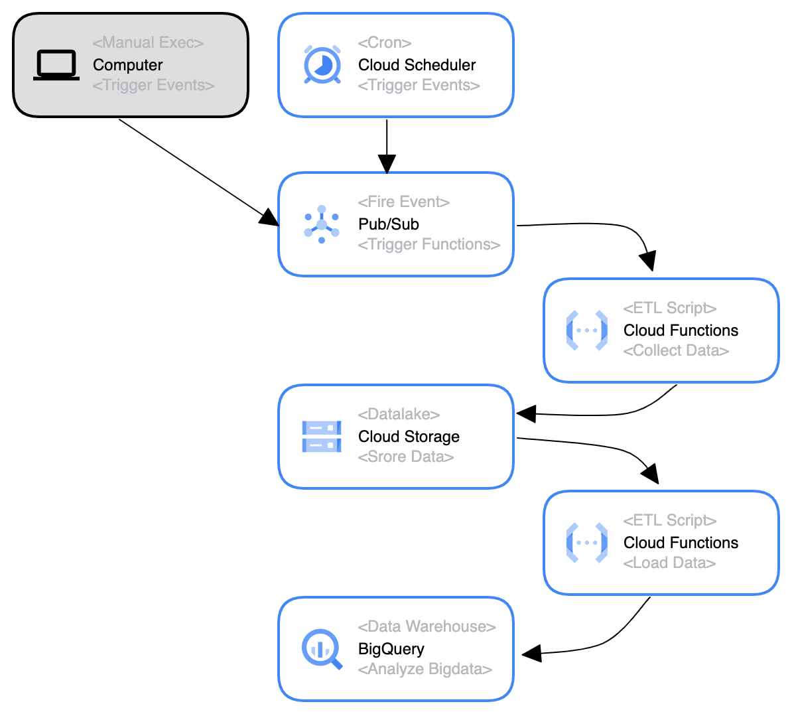
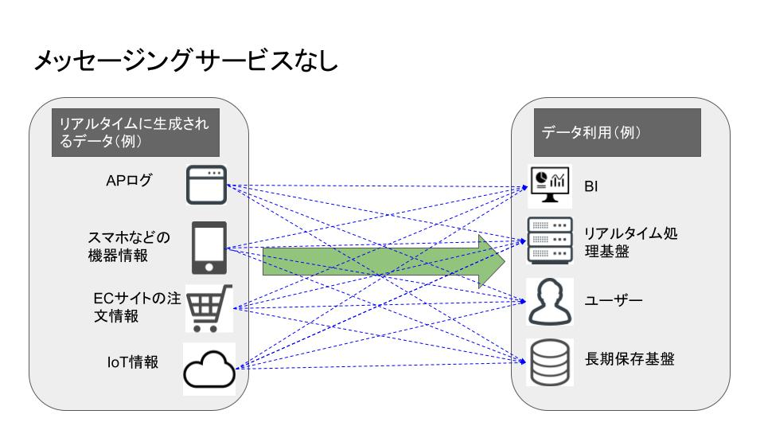
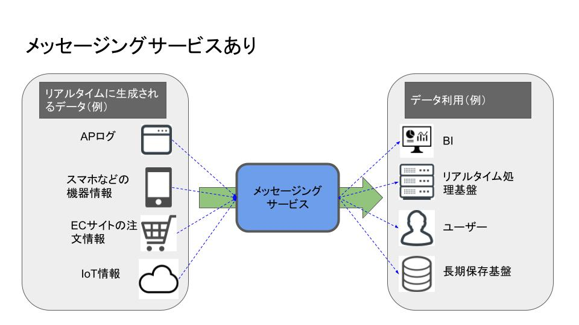

---
# @see https://docusaurus.io/docs/api/plugins/@docusaurus/plugin-content-blog#markdown-front-matter
# Metadata (Recommended) ------------------------------------
title: "netkeiba のデータをスクレイピングして LOD 化する（7）"
date: "2023-03-03"
tags:
  - "python"
  - "競馬"
  - "GCS"
  - "DWH"
# draft: true  # if true, the article is `WIP` and therefore should not be published yet
# Allows to customize the blog post url (/<routeBasePath>/<slug>)
# slug: ''   # default is current file path
authors: kiai  # @see authors.yml
# -----------------------------------------------------------
# Additional ------------------------------------------------
# hide_table_of_contents:   # if true, rightside ToC will be invisible
# toc_min_heading_level: 2  # The minimum heading level shown in the ToC
# toc_max_heading_level: 3  # The max heading level shown in the ToC
# for SEO
keywords:
  - "python"
  - "競馬"
  - "GCS"
  - "DWH"
# description: '<Desc>'
# for `og:image` and `twitter:image` (.png or .jpg, NOT .svg)
image: "https://custom-og-image-generator.vercel.app/api/**netkeiba.com**%20%E3%81%AE%E3%83%87%E3%83%BC%E3%82%BF%E3%82%92%E3%82%B9%E3%82%AF%E3%83%AC%E3%82%A4%E3%83%94%E3%83%B3%E3%82%B0%E3%81%97%E3%81%A6LOD%E5%8C%96%E3%81%99%E3%82%8B%EF%BC%887%EF%BC%89.png?theme=light&copyright=Kiai+de+Nantoka&logo=https%3A%2F%2Fimg.icons8.com%2Fglyph-neue%2F64%2F000000%2Fhorse.png&avater=https%3A%2F%2Favatars.githubusercontent.com%2Fu%2F20794309&author=Kiai&aka=%40Ningensei848&site=%E6%B0%97%E5%90%88%E3%81%A7%E3%81%AA%E3%82%93%E3%81%A8%E3%81%8B&tags=python&tags=%E7%AB%B6%E9%A6%AC&tags=GCS&tags=DWH"
---

import Tabs from '@theme/Tabs';
import TabItem from '@theme/TabItem';

[前回の記事](/content/blogs/2023/02/07.md)では、構想を練るところまでやった。



苦節一ヶ月、ついに実現し**毎日自動でデータを集め、それが BigQuery にロードされるようになった**ので、苦労した点をつらつらと書いていく。

<!-- truncate -->

## 目次

1. そもそもプロダクト(Pub/Sub)の役割がわかっていなかった
2. CloudEvent ってなに？
3. イベント駆動の Cloud Functions (Gen 2) はどうやってデプロイするの？
4. BigQuery にはユニーク制約が無い！
5. BigQuery は何でも入れればいいわけではない

## 1. Pub/Sub の役割

[Cloud Scheduler](https://cloud.google.com/scheduler) については、まぁすぐに理解できた。
単に Cron を設定してその時間通りに Pub/Sub を起動するだけだからだ。

が、「Pub/Sub 起動する」ってなに？？？となってしまった。。。

---

> Pub/Sub は、メッセージを生成するサービスを、それらのメッセージを処理するサービスと切り離す、非同期のスケーラブルなメッセージング サービスです。
>
> cf. https://cloud.google.com/pubsub/docs/overview

これだけをはじめて読んだときは「？？？」としかならないと思うんだが、次の記事を読みつつ自分で手を動かしてみることで理解することができた：

> [【図解付き】Cloud Pub/Sub に概要や使い方についてわかりやすく解説 - KIYONO Engineer Blog](https://laboratory.kiyono-co.jp/69/gcp/)

https://laboratory.kiyono-co.jp/69/gcp/

#### メッセージングサービスがないと……

Pub/Sub のようなプロダクトがない場合、データの「送信元」「受信先」がすべて１対１対応になってしまい、複雑かつ情報ロストのリスクが増えてしまう。
例の通り４：４の構成だと、4 \* 4 = 16 通りの経路が生じるし、n 個の構成物があれば n^2 に増大してしまう。。。

[](https://laboratory.kiyono-co.jp/69/gcp/)

#### メッセージングサービスがあると……

間に Pub/Sub を挟むことで、メッセージングサービスに管理を集中させることができる。
経路は一箇所にまとめられるし、Pub/Sub は機能したかだけを気にしていればよい。

[](https://laboratory.kiyono-co.jp/69/gcp/)

#### ML4Keiba では

1. Pub/Sub でトピックを作成する
    - ただ作成するだけ
    - 処理を仲介するインスタンスを定義するイメージが近い
2. このトピックを指定して Cloud Functions 関数をデプロイ
    - 購読する（Subscript する）のがこの関数
    - 言い換えれば、指定トピックのサブスクライバーの一つとしてこの関数を指定する
3. Cloud Scheduler から毎日定時に事前設定したメッセージを **Pub/Sub のトピックに向けてパブリッシュ**する

こうして、Pub/Sub 上の指定トピックが受け取ったペイロードを、そのままサブスクライバーたちに送信することができた
（メッセージのパブリッシュイベントを通じて CF 関数を発火させることができた）

#### 勘違いしたこと

誤り　 → 　「Pub/Sub は Cloud Scheduler からしか起動できない！」

正解　 → 　「Pub/Sub は **多様な Publisher から起動できる**」

---

Cloud Scheduler はあくまで数ある Publisher の一つでしかなく、Google がお手軽 Cron として提供しているだけである。

> Pub/Sub 環境は、Google Cloud Console、Cloud Shell、クライアント ライブラリ、REST API のいずれかを使用して設定できます。
>
> cf. [Pub/Sub のクライアントライブラリ](https://cloud.google.com/pubsub/docs/publish-receive-messages-client-library)

## 2. CloudEvent とは

Q. Pub/Sub でメッセージを送れるのはわかったけど、Cloud Functions でどうやってそれを購読すればいいの？
（Pub/Sub のサブスクライバーってどうすれば設定できるの？）

A. [CloudEvent オブジェクト](https://github.com/cloudevents/sdk-python/blob/main/cloudevents/http/event.py)を引数として受け入れる CloudEvent 関数を作成する

---

[`mypy`](https://github.com/python/mypy) で型付ける時にどないすんねん 💢
とブチ切れたが、別途 [`cloudevents`](https://github.com/cloudevents/sdk-python) を入れてやればよかった。
オブジェクトにはプロパティとして `attributes` と `data` が含まれており、その `data` 内には、Pub/Sub がトリガーしたイベントでは(第２世代 Cloud Functions の場合)以下のようなオブジェクトが含まれている：

```js title="MessagePublishedData"
{
    "message": {
        // 注）data は base64 で encode されている → デコードしてやる必要あり
        "data": string,
        "attributes": {
            string: string,
            ...
        },
        "messageId": string,
        "publishTime": string,
        "orderingKey": string
    }
}
```

:::caution

[イベント ドリブン関数を作成する  |  Google Cloud Functions に関するドキュメント](https://cloud.google.com/functions/docs/writing/write-event-driven-functions)でも説明されているように、 Cloud Function (Gen 2) においてはすべて「CloudEvent 関数」を使用する。

:::

:::danger

Pub/Sub トリガーを CloudEvent 関数で使う場合、データのペイロードは [`MessagePublishedData`](https://github.com/googleapis/google-cloudevents/blob/main/proto/google/events/cloud/pubsub/v1/data.proto) になる。

[Cloud Pub/Sub のチュートリアル（第 2 世代）  |  Google Cloud Functions に関するドキュメント](https://cloud.google.com/functions/docs/tutorials/pubsub#preparing_the_application)にもある通り、`cloud_event.data["message"]["data"]` という形でアクセスする。

得られる文字列は **`base64` でエンコードされた文字列**であることにも留意すること。

:::

### サンプルコード

<Tabs>
<TabItem value="py" label="Python">

```python title="sample.py"
import base64
import functions_framework

from cloudevents.http import CloudEvent

# Triggered from a message on a Cloud Pub/Sub topic.
@functions_framework.cloud_event
def subscribe(cloud_event: CloudEvent) -> None:
    # Your code here
    # Access the CloudEvent data payload via cloud_event.data

    # base64 encoded string
    data: str = cloud_event.data["message"]["data"]
    byte_string: bytes = base64.b64decode(data)
    decoded_txt: str = byte_string.decode()

    print(decoded_txt)

    return
```

</TabItem>
<TabItem value="ts" label="TypeScript">

```ts title="sample.ts"
import functions, { CloudEvent } from '@google-cloud/functions-framework'
import { MessagePublishedData } from '@google/events/cloud/pubsub/v1/MessagePublishedData'

// Triggered from a message on a Cloud Pub/Sub topic.
functions.cloudEvent<MessagePublishedData>('subscribe', (cloudEvent) => {
    // Your code here
    // Access the CloudEvent data payload via cloudEvent.data

    // base64 encoded string
    data: string = cloud_event.data["message"]["data"]
    byte_string = Buffer.from(data, 'base64')
    decoded_txt = byte_string.toString()

    concole.log(decoded_txt)

    return
})
```

</TabItem>
</Tabs>

つまり、Pub/Sub でトリガーした Cloud Functions 関数は、`subscribe()` 以下を起点として実行すればよい。

cf. [Cloud Pub/Sub のチュートリアル（第 2 世代）  |  Google Cloud Functions に関するドキュメント](https://cloud.google.com/functions/docs/tutorials/pubsub)

## 3. イベント駆動の Cloud Functions (Gen 2) のデプロイ方法

Cloud Functions 関数において、 Pub/Sub をトリガーとして CloudEvent をサブスクライブすることで実行できることはわかった。
しかし、その 関数はどうやって設置、もとい GCP 上で実行できるようにすればいいんだ？

当然、GCP のコンソールからポチポチやればできるとして、それ以外には **[`gcloud CLI` を使う方法がある](https://cloud.google.com/functions/docs/deploy#gcloud)**。
この CLI を用いてコマンドを実行する際に、オプション引数として `--trigger-topic` フラグの値に 購読したい Pub/Sub トピックの名前を渡してやればよい。

cf. [Pub/Sub トリガー  |  Google Cloud Functions に関するドキュメント](https://cloud.google.com/functions/docs/calling/pubsub)

---

他に注意すべき点として、以下の三点が挙げられる：

1. `--entry-point` フラグを用いてエントリーポイントを指定する
2. `--source` フラグを用いて指定するディレクトリには、構造について必須要件がある
3. 外部ライブラリを用いている場合には、言語ごとのアプローチで依存関係を指定して解決する

### エントリーポイントの指定

GCP 側に対して、どの関数を実行するのかを明確に伝えてやる必要がある。
そのために指定するのがエントリーポイントである。

例に上げた Python, Node.js の両方とも、エントリーポイント名は `subscribe` である。
`@functions_framework.cloud_event` あるいは `functions.cloudEvent` で渡してやることで、エントリーポイントとして登録されたことになるらしい。

### ディレクトリの必須要件

[ソース ディレクトリの構造 | Cloud Functions の関数を作成する | Google Cloud Functions に関するドキュメント](https://cloud.google.com/functions/docs/writing#directory-structure) を見れば分かる通り、**各言語ランタイムごとにソースコードの構造に制限がある**。

<details>
<summary>Python の場合</summary>

例えば `Python` では、`--source` で指定したディレクトリ内に `main.py` を置き、その中にエントリーポイントを登録しなければならない。

```
.
└── main.py
```

> Cloud Functions は、関数ディレクトリのルートにある main.py という名前のファイルからソースコードを読み込みます。
> メインファイルの名前は main.py にする必要があります。

</details>

<details>
<summary>Node.js の場合</summary>

`Node.js` では、`--source` で指定したディレクトリ内に `package.json` と その中の項目 `main` で指定したスクリプト (e.g. _index.js_) が存在していなければならない。

> Node.js 関数の基本的なディレクトリ構造は次のとおりです。
>
> ```
> .
> ├── index.js
> └── package.json
> ```
>
> デフォルトでは、Cloud Functions は関数ディレクトリのルートにある _index.js_ というファイルからソースコードを読み込みます。
> 別のメイン ソースファイルを指定するには、package.json ファイルの `main` フィールドを使用します。

</details>

### 依存性解決

言い換えれば、どうやってスクリプトが使用している外部ライブラリを指定するかという問題である。

Python の場合には [`functions-framework==3.*`](https://github.com/GoogleCloudPlatform/functions-framework-python) が含まれた _requirements.txt_ を、Node.js の場合には `dependencies` に `"@google-cloud/functions-framework": "^3.0.0"` が含まれた _package.json_ をディレクトリ内に設置する必要がある。

-   [Python での依存関係の指定  |  Google Cloud Functions に関するドキュメント](https://cloud.google.com/functions/docs/writing/specifying-dependencies-python)
-   [Node.js での依存関係の指定  |  Google Cloud Functions に関するドキュメント](https://cloud.google.com/functions/docs/writing/specifying-dependencies-nodejs)

### 最終的なデプロイコマンド

```shell
gcloud functions deploy YOUR_FUNCTION_NAME \
    --gen2 \
    --region YOUR_REGION \
    --runtime YOUR_RUNTIME \
    --source YOUR_SOURCE_LOCATION \
    --entry-point YOUR_CODE_ENTRYPOINT \
    --trigger-topic YOUR_PUBSUB_TOPIC
```

:::caution

> 最初の引数 YOUR_FUNCTION_NAME は、デプロイされた関数の名前です。
>
> 第 1 世代の関数名は、**先頭が英文字で、その後に最大 62 文字の英文字、数字、ハイフン、アンダースコアで構成**します。末尾は英文字または数字にする必要があります。
>
> 第 2 世代のルールも同様ですが、**最初の文字は英小文字にする必要があり、アンダースコアは使用できません**。

:::

:::tip

`gcloud functions deploy` には、他にも様々なオプション設定を渡すことができる。

-   `--memory` ... 実行時のメモリサイズを指定する
    -   いくつかの中から選ばなければならない
        -   cf. https://cloud.google.com/functions/docs/configuring/memory
    -   どれを選んだかによって、どのくらい [vCPU](https://cloud.google.com/compute/docs/cpu-platforms) が割り当てられるか変動する
-   `--service-account` ... サービスアカウントを指定する
    -   CF 関数が他のプロダクトと連携する場合、適切な IAM を付与したサービスアカウントを割り当てる必要がある
    -   指定しない場合、Cloud Functions のデフォルトサービスアカウントが割り当てられる
-   `--timeout` ... 最大実行時間を設定する
    -   max は 3600s だが、CloudEvent をトリガーとする場合には 540s に制限されるとか
-   `--set-env-vars` ... 環境変数を指定する
    -   秘密情報は `--set-secrets` で渡すとよい
-   `--update-labels` ... ラベルを付与する
    -   多数の関数をデプロイする際に、コンソール側においてはラベルごとフィルタできると便利

cf. [`gcloud functions deploy` | Google Cloud CLI Documentation](https://cloud.google.com/sdk/gcloud/reference/functions/deploy)

:::

## 4. ユニーク制約 not in BigQuery

普通のデータベースだったら確実に存在している「ユニーク制約」という概念が BigQuery にはない。
すなわち、Insert 命令を出したら特に重複等は検証せずそのまま追加してしまう。

どうすれば重複しないように BigQuery に読み込むことができるだろうか？

結論を言えば、以下の二点の工夫を凝らせば実現できた：

1. GCS 側にアップロードする際に「新規作成」だけを許可して「更新」を拒否する
2. ファイルごとに固有の ID を振り分け、データにも冪等性を確保する

### Rerational DB を使う

本来であれば、抽出したデータをそのままロードするのではなく、一旦オペレーショナル DB に突っ込んでユニーク制約を付けてから読み出す方法が一般的だろう。
企業で持っているデータとかから BigQuery に入れたいというときなどはぜひともそのようにすべきだ。

もちろんそのようにしたとしても、その操作を複数回行なってしまうと元も子もないため、ある程度の対策を寝る必要はあるらしい。

cf. [BigQuery でのデータ追記処理における冪等化の取り組み - ZOZO TECH BLOG](https://techblog.zozo.com/entry/idempotent-data-insert-in-bigquery)

### 工夫してなんとかする

で、ML4Keiba においてはオペレーショナル DB は存在しない。
かといって新たに Cloud SQL とか契約するのも、無駄なコストが嵩むようで嫌だ。
実際にサービスインできる目処が立ったとかならまだしも、ユニーク制約を確保したいというだけでランニングコストを増やすのは、どうにかして回避したい。

一つは、「冪等性の確保」を考えた。
ファイルごとに個別の ID で管理し、GCS に突っ込む際に「新規作成は許すけど更新は拒否する」という処理が実現できれば、常に独立したデータだけが蓄積されていくことになる。
こうすれば BigQuery への load には、[GCS のオブジェクトファイナライズトリガー](https://cloud.google.com/functions/docs/calling/storage)を使えばよいだけとなる。

---

じゃあ、この個別の ID とはなんぞや？という部分を考えるだけなのだが、ここは幸いもとからうまいこと設計されていた。

データを取ってくる際に、レース情報は日付 `YYYYMMDD` をシード値としていたため、これをそのままディレクトリ構造に転用することで、ファイルの重複を防ぐことができた。
レースの情報以外には馬自身の情報（プロフィール）が必要となるが、そちらは馬ごとに固有の ID (`horse_id`)で管理することができる。

:::caution

馬のプロフィールには、調教師やオーナー、獲得賞金、通算成績などがページには含まれている。
これらの情報は**更新可能性がある**データなので冪等ではない…のだが、実際問題ほとんど変化しないものと考えてよいだろう。

幸い、１０万ほどの馬情報を収集してもそれほど大きなデータにはならないため、年に一回程度の頻度で更新できれば良いと考えている。

:::

## 5. BigQuery はゴミ箱じゃない

GIGO: Garbage In, Garbage Out という言葉もある通り、ゴミデータを分析したところでゴミしか得られない……のだが、それ以前の問題として**スキーマをきちんと定義しないと BigQuery にロードすることもできない**という状況に直面した。
というのも、ロードする際にオプションとして `autodetect` を指定していたことが原因だ。

例えば大きなデータを複数個同時に読み込ませるなら問題は起こりにくい。
一箇所では整数型っぽいが、他方では文字列型っぽいという状態を含むだろうからだ。
しかし、小さなデータを一つずつ少しずつ入れていく場合、最初に入れたデータが初見では整数型に見えるが実は文字列型でした！なんてことがザラに起きる。もちろん型が異なれば、うまく読み込めずエラーが起きる。

こうならないためには、きちんと手動で型を定義する、もといスキーマを定義してやる必要がある。
これがつらい……

CSV なら、ヘッダーに含まれるカラム数の分だけ一対一対応するスキーマを書かねばならない。
テーブルが一つ二つならまだしも、十より多くなると悲惨である。

それでも、きちんと読み込ませるには自分で地道にスキーマを書くことが必要だ。
心を無にして、目の前のデータ型定義を進めよう。。。

## 総括

料金の内訳はｍおおよそ以下の通り：

-   Cloud Scheduler ... ¥0
-   Cloud Pub/Sub ... ¥0
-   Cloud Storage ... ¥100
-   Cloud Functions ... ¥900
-   BigQuery ... ¥0

Cloud Functions を読んでリクエストしまくったから結構行くかな〜と思っていたら 1000 円そこらで収まってしまった。
あまりにも激安で心配になるレベルである。

ちなみにこれはイニシャルコストというだけで、今後は GCS のストレージ料金が固定で ¥100 - ¥200 くらいと、BigQuery でクエリを実行し得られたデータ分だけとなる。
BigQuery に課金されるくらいデータ分析を重ねたいものであるなぁ……

サービス云々については、まだ実際にやるかどうかは決めていない。
というかデータ分析をやっていい感じの成績が出せるかどうかもまだわからない。
もし出せそうなら、それを売りにしたデータ提供サイトでもつくるかな……

それより実現性が高い案として、例えば[pyparsing で競馬のコーナー通過順位をパース →Plotly で可視化](https://zenn.dev/kun432/articles/visualize-keiba-corner-pandas-plotly)できるそうなので、そういう過去情報とかを馬ごと、レースごとに提供できると面白そうだ。
出走馬情報については一日前に取得できるから、その馬の数がおおよそ 12 頭 \* 12 R \* 3 会場 で 450 くらいとなる。
そのぐらいなら、GitHub Pages でどうにか静的ページに落とし込めそうだと思う。
ぜひやりてぇな………
