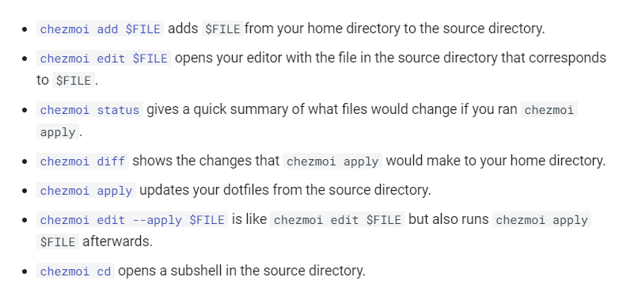

---
# @see https://docusaurus.io/docs/api/plugins/@docusaurus/plugin-content-blog#markdown-front-matter
# Metadata (Recommended) ------------------------------------
title: ".dotfiles で管理したい"
date: "2024-04-29"
tags:
  - "2024GW"
  - "dev"
  - "dotfiles"
  - "zsh"
# draft: true  # if true, the article is `WIP` and therefore should not be published yet
# Allows to customize the blog post url (/<routeBasePath>/<slug>)
# slug: ''   # default is current file path
authors: kiai  # @see authors.yml
# -----------------------------------------------------------
# Additional ------------------------------------------------
# hide_table_of_contents:   # if true, rightside ToC will be invisible
# toc_min_heading_level: 2  # The minimum heading level shown in the ToC
# toc_max_heading_level: 3  # The max heading level shown in the ToC
# for SEO
keywords:
  - "2024GW"
  - "dev"
  - "rye"
  - "volta"
  - "dotfiles"
# description: '<Desc>'
# for `og:image` and `twitter:image` (.png or .jpg, NOT .svg)
image: "https://custom-og-image-generator.vercel.app/api/%60.dotfiles%60%20%E3%81%A7%E7%AE%A1%E7%90%86%E3%81%97%E3%81%9F%E3%81%84.png?theme=light&copyright=Kiai+de+Nantoka&logo=https%3A%2F%2Fraw.githubusercontent.com%2Fmotdotla%2Fdotenv%2Fmaster%2Fdotenv.svg&avater=https%3A%2F%2Favatars.githubusercontent.com%2Fu%2F20794309&author=Kiai&aka=%40Ningensei848&site=%E6%B0%97%E5%90%88%E3%81%A7%E3%81%AA%E3%82%93%E3%81%A8%E3%81%8B&tags=2024GW&tags=dev&tags=dotfiles"
---

新生活に浮かれて[こういう私用ノートPC](https://dynabook.com/direct/mobile-note-pc/xz-series/xz-hw.html)を買ってしまった。
ので、色々と設定していかないといけない。

ここ最近はバ先に貸与された Mac Book Pro だったので何も考えていなかったが、いざwin11に触れると進化がすごい。
そしてそれはそれとしてコマンドプロンプトがクソ、PowerShellは我が道を行きすぎィ！
という経緯もあり、早々に諦めてWSL2(Ubuntu)に手を出すこととする。
もちろんまっさらはじめから、ということで、作業記録を残しつつ「どうすればPCの式年遷宮を乗り越えていくか」という視点で考えたい。

<p align="center"></ p>

<!-- truncate -->

## 必要なものを考える

Windows Terminal も使えて楽し～～という気分はさておき、WSL2 (Ubuntu 24.04 LTS[^1]) までは導入済みという前提で進める。

[^1]: [The Coronation of a New Mascot: Noble Numbat | Ubuntu](https://ubuntu.com/blog/the-coronation-of-a-new-mascot-noble-numbat)

まず、shell をどうするかについて、これは特にこだわりなければ zsh を導入するのがいいと考えている。
面倒なら bash のままでもいいのだが、カスタマイズせにゃあな～～という気持ちもあり、どうせやるなら zsh の波に乗ったほうがいいと考えた。

他には、当然 `git`, `python`, `node` あたりが必要になるが、`git` は Ubuntu 備え付けだし、ほか2つは管理ツールを使いたい……
という事情もあり、話題の `rye` と `volta` （奇しくも両方が Rust 製）を扱ってみることとする。

あと現時点で考えうるのは Rust や Docker の実行環境とか、GCP, AWS, Azure あたりの CLI とか、CUI Editor とか、そのへんだろうか。

（書きつつ思い出したが、大学時代の Google Workspace を GW 中に引っ越しせねばならないのであった……
容量制限をあとから課す措置を下す行為になんらかの罰則を制定してほしい……）

### `Zsh` (with _Oh my Zsh_)[^2]

[^2]: cf. https://github.com/ohmyzsh/ohmyzsh/wiki/Installing-ZSH

<p align="center"></ p>

Ubuntu の場合、 `apt` ないし `apt-get` でどうにかするのがいいようだ。
前者はインタラクティヴ、後者はスクリプト向けということで、ワンライナーで書くと以下の通り：

```shell
sudo apt-get -y update && \
sudo apt-get -y upgrade && \
sudo apt-get -y install zsh && \
zsh --version && chsh -s $(which zsh) && \
echo $SHELL && $SHELL --version
```

再度シェルを起動し直すと、 `bash` ではなく `zsh` に切り替わっている。
初回起動時には色々設定をする必要があるが、内容をよく見て選択すること。

---

#### 追記: 2024-05-01

[後日に再検討した](content/blogs/2024/05/01.md)ところ、「いまから新しく始める」のなら [`sheldon`](https://github.com/rossmacarthur/sheldon) がよいという結論に至った。
見た目の方は [Starship](https://starship.rs/) で調整する。
いずれも Rust 製であり、速度や信頼も申し分ないしサイコーな予感が溢れている。
GW 中にこれらのカスタマイズができると嬉しいが……？

<details>
<summary>当時は若く、`oh-my-zsh` しか知りませんでした（ぇ</summary>

zsh をカスタマイズしやすくするフレームワークとして _Oh my Zsh_ がある。
これもついでに入れてみる。

```shell
sh -c "$(curl -fsSL https://raw.githubusercontent.com/ohmyzsh/ohmyzsh/master/tools/install.sh)"
```

だいぶ見栄えと雰囲気が良くなった気がする。
これをいい感じにカスタマイズしていくのだが、今は取り敢えず放置。
一旦区切りにして次へ行こう。

</details>

### `rye`

<p align="center"></ p>

> Rye is a comprehensive project and package management solution for Python.
> Born from its creator's desire to establish a one-stop-shop for all Python users,
> Rye provides a unified experience to install and manages Python installations,
> pyproject.toml based projects, dependencies and virtualenvs seamlessly.
> It's designed to accommodate complex projects,
> monorepos and to facilitate global tool installations.

cf. https://rye-up.com/guide/installation/

`pyenv`, `virtualenv`, `venv`, `conda`, `pipenv`, `poetry` 等々、Python の仮想環境を管理しようとする試みは多々あったが、現状の最新＆最速[^3]のツールは `rye` であるらしい[^4]。
これも簡単にインスコできるし、"zsh completion" （自動補完）もついてくるようなのでサクッと入れてしまおう。

[^3]: [uvとpipの仮想環境構築速度の比較](https://zenn.dev/link/comments/3538b859f8b7d7)
[^4]: [Rye uv おっかけ 202403](https://zenn.dev/tkm/articles/rye-uv-202403)

```shell
curl -sSf https://rye-up.com/get | bash && \
echo 'source "$HOME/.rye/env"' >> ~/.zprofile && \
source ~/.zprofile && \
echo $ZSH_CUSTOM && \
mkdir $ZSH_CUSTOM/plugins/rye && \
rye self completion -s zsh > $ZSH_CUSTOM/plugins/rye/_rye
```

取り敢えず使えるようにはなったはずだが、いかんせん使い方がまだまだよくわからない。
設定方法等も踏まえて再度備忘録的な記事を書いておく必要がありそうだ（GW中に書くかな？）。

### `volta`

<p align="center"></ p>

> ⚡ Fast<br/>
> Install and run any JS tool quickly and seamlessly! Volta is built in Rust and ships as a snappy static binary.
>
> ⚡ Reliable<br/>
> Ensure everyone in your project has the same tools—without interfering with their workflow.
>
> ⚡ Universal<br/>
> No matter the package manager, Node runtime, or OS, one command is all you need: volta install.

cf. https://volta.sh/

`nvm`, `nodenv`, `nodebrew`, `n`, `fem` 等々、 `node.js` を管理しようとする試みはたくさんある。
この中だと `nvm` が昨今だと強いかもしれない。
だが、`volta` はそんな状況に一石を投じる管理ツールだ。
Rust 製なのでかなり速いし、OS の差異を意識しなくていいし、何より `package.json` 一つで `npm` / `yarn` 等も含めて管理できてしまう。

```shell
curl https://get.volta.sh | bash && \
source ~/.zshrc && \
echo $ZSH_CUSTOM && \
mkdir $ZSH_CUSTOM/plugins/volta && \
volta completions zsh -o $ZSH_CUSTOM/plugins/volta/_volta
```

……まぁまだ触れる機会が少ないので他人の受け売りなのだが。

## `.dotfiles` という概念

そもそもとして、「実は理解が甘いのでは？」と考えたので、一応拙速に調べ直してみた。

- [ようこそdotfilesの世界へ #Vim - Qiita](https://qiita.com/yutkat/items/c6c7584d9795799ee164)
  - 検索結果の一番上に出てくるし、Qiita でもかなりの評価を得ている記事（概要がつかみやすい）
- [GitHubでスター数の多いdotfilesを使ってみた](https://zenn.dev/yutakatay/articles/try-dotfiles-01)
  - 実際に調べてみた系の記事 → '20年時点でのよさげな dotfiles の先人たちの例を挙げている
  - 調査方針はこれを読みつつ固めることにする
- [dotfilesの育て方 #Linux - Qiita](https://qiita.com/reireias/items/b33b5c824a56dc89e1f7)
  - dotfiles をリポジトリとして捉えたときに、どうやって継続的に運用するかという視点で書かれた記事
  - 実際に自分のを作ったら、これを参考にして続けられるようにしよう
- [dotfilesのこだわりを晒す - エムスリーテックブログ](https://www.m3tech.blog/entry/dotfiles-bonsai)
  - つよつよエンジニアのこだわりレシピ、zsh 等のカスタマイズ面でも参考にできそう
- [Rust製ツールまみれのdotfilesを始めた](https://zenn.dev/5ei74r0/articles/create-dotfiles)
  - 他の開発についても言えることだが、1. **Auto Sync** 2. **Continuous Integration** 3. **Installer** を用意するのはとても大切
  - なぜなら我々は「いつだって怠惰」なので……

---

まとめると、以下の３点が `.dotfiles` を作成する上で重要な要素となる：

1. **リポジトリとして管理する**
2. **育てる！ ＝ 継続的に運用する**
3. **再利用しやすくしておく**

これらの観点を意識して、自分だけのカスタマイズをやってみよう。
作業の記録を次の章から残しておくこととする。

## やってみよう

色々と探してみたが、上記３点をもっとも満たしやすそうなのは一つだけだった。
すなわち、dotfiles の管理ツールとして Go-lang 製の [`chezmoi`](https://www.chezmoi.io/) を採用する。
いちいちシンボリックリンクを貼るとかインストールスクリプトを書くとかやってられないからだ。
そのへんを全部サポートしてくれることを期待して、次のようにインストールする：

```shell
sh -c "$(curl -fsLS get.chezmoi.io)" -- -b $HOME/bin && \
echo '# chezmoi\npath+=("$HOME/bin")\n' >> ~/.zshrc && \
source ~/.zshrc && which chezmoi && chezmoi --version && \
echo $ZSH_CUSTOM && mkdir $ZSH_CUSTOM/plugins/chezmoi && \
chezmoi completion zsh --output=$ZSH_CUSTOM/plugins/chezmoi/_chezmoi
```

こうして chezmoi をダウンロードし、ついでに PATH も通した（`~/.zshrc` に追記した）。
次に、`chezmoi init` することで `~/.local/share/chezmoi` 直下に dotfiles を管理するためのリポジトリが作られる。

ここで注意したいのは、既に `dotfiles` リポジトリが存在している場合、それを引き継げるということだ。
例えば、俺はすでに５年前に[自分用の dotfiles](https://github.com/Ningensei848/dotfiles) を作成していた。
（全く記憶にないが……）
今回はこれを引き継ぐ形で（ほぼぶっ壊しだろうが）進めていくこととする。

```shell
export GITHUB_USERNAME="Ningensei848" && \
chezmoi init $GITHUB_USERNAME --ssh
```

---

[Quick Start](https://www.chezmoi.io/quick-start/) にもある通り、おおよその流れは以下の通り：

1. `chezmoi add $FILE_NAME` ... ファイルをコピーして管理下に置く
2. `chezmoi edit $FILE_NAME` ... リポジトリ下にあるファイルを開く
3. `chezmoi -v apply` ... 変更を元のファイルに反映する

`chezmoi add` したファイルは、Prefix として `dot_` が付与される。
vscode 等のエディタで開いたときは、この名前のファイルを編集すればいい。
いくつかファイルを編集したら、その変更をリポジトリにコミットせねばならない。
このとき、`chezmoi cd` とすることで `~/.local/share/chezmoi` に移動できる。
そのまま `chezmoi diff` 等で変更点を確認したら、`chezmoi git --add` して `chezmoi git --commit` した後に、`chezmoi git --push` してやればよい。

（これは「もしコマンドでやるなら」という話であって、ファイルの編集や Git の操作等は VSCode から GUI 経由でやっても構わない。
最終的に、変更履歴を元ファイル、つまり `dot_file` ではなく `.file` に反映するために、
`chezmoi -v apply` というコマンドを実行せねばならないというだけの話である）

また、困ったときは `chezmoi help` とか、 `chezmoi doctor` あるいは `chezmoi status` とやればよい。
自ずと何をどうすればいいかわかるだろう。

[](https://www.chezmoi.io/user-guide/command-overview/#daily-commands)

## できた

というわけで、実際に作成したのが [**こちら**](https://github.com/ningensei848/dotfiles) ↓

https://x.com/Ningensei848/status/1784934787314291026

まだ慣れていない＋そもそも全然カスタマイズしていないというのもあり、「継続的に運用する」という目標は未達となった…… 😿
とはいいつつ、GitHub Actions 上で異なる OS ごとに実行できるか確認するような CI/CD 処理を書けばいいだけだ。
余裕が生まれてからサクッと追記したい。

それに乗せらられば、最後の「再利用しやすく」という目標も自然とクリアできることになる。
どんな環境であれ、`Chezmoi` がインストールできれば、`chezmoi init --apply $GITHUB_USERNAME` で即座に使い始められるはずだ。
もっとも、OS ごとに使えるシェルの差異を埋めるためにもう一捻り必要になるかもしれないが（や窓ク）。

## おわりに

気づけば GW も３日過ぎてしまった。
３月～４月とほとんどこういう稼働ができなかったことでそこかしこが錆びついている感じだ。

他にも GW 中に済ませねばならないことがたくさんある。
具体的には Google Project の式年遷宮とか……
（組織に紐づいているものを別の組織に移す；頭が痛い作業が残っている）

明日は平日ということで、本来は仕事があるはずのところ、年次休暇を頂いている
（というか強制的に３日分取得させられている；教育の日程上仕方ないのだが）。
明日こそはもっと有意義に時間を過ごせるようにしたい…

やっていきましょう、気合でなんとかします
