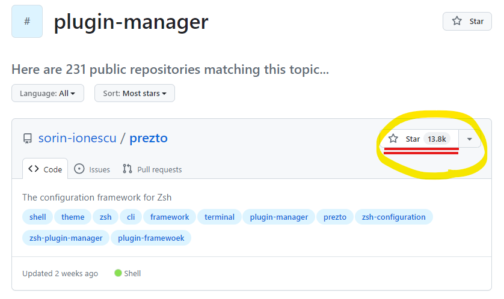

---
# @see https://docusaurus.io/docs/api/plugins/@docusaurus/plugin-content-blog#markdown-front-matter
# Metadata (Recommended) ------------------------------------
title: "zsh プラグイン管理を考える"
date: "2024-05-01"
tags:
  - "2024GW"
  - "dev"
  - "zsh"
# draft: true  # if true, the article is `WIP` and therefore should not be published yet
# Allows to customize the blog post url (/<routeBasePath>/<slug>)
# slug: ''   # default is current file path
authors: kiai  # @see authors.yml
# -----------------------------------------------------------
# Additional ------------------------------------------------
# hide_table_of_contents:   # if true, rightside ToC will be invisible
# toc_min_heading_level: 2  # The minimum heading level shown in the ToC
# toc_max_heading_level: 3  # The max heading level shown in the ToC
# for SEO
keywords:
  - "dev"
  - "zsh"
  - "sheldon"
  - "starship"
# description: '<Desc>'
# for `og:image` and `twitter:image` (.png or .jpg, NOT .svg)
image: "https://custom-og-image-generator.vercel.app/api/%60zsh%60%20%E3%81%AE%E3%83%97%E3%83%A9%E3%82%B0%E3%82%A4%E3%83%B3%E7%AE%A1%E7%90%86%E3%82%92%E8%80%83%E3%81%88%E3%82%8B.png?theme=light&copyright=Kiai+de+Nantoka&logo=https%3A%2F%2Fraw.githubusercontent.com%2FZsh-art%2Flogo%2F17617f2f6c70c65943a48745c91d997e7561f19d%2Fsvg%2Fcolor_logomark.svg&avater=https%3A%2F%2Favatars.githubusercontent.com%2Fu%2F20794309&author=Kiai&aka=%40Ningensei848&site=%E6%B0%97%E5%90%88%E3%81%A7%E3%81%AA%E3%82%93%E3%81%A8%E3%81%8B&tags=2024GW&tags=dev&tags=zsh"
---

つい昨日、[`Oh My Zsh`](https://ohmyz.sh/) を採用すると宣言したのもつかの間、カスタマイズをしようと調べ始めたら「起動速度が気になる」「デカいからもっさりしちゃう」「もっと新しいの使え」などとたくさんのコメントに触れた。

そんなにいうならどれ使うんだよ！！！！！！となったため、取り敢えず現時点での最新情報をまとめてみることにした。
いや、そんな手間かけるよりググれカスと誹られて当然だが、先ずは自分で調べてみるのもリハビリなので……
ということで、やっていきましょう。

</ p>

<!-- truncate -->

## ググる

まずはググってみる（それはそう）。
「[zsh plugin manager 2024](https://www.google.com/search?q=zsh+plugin+manager+2024)」で検索すると、[Reddit の記事（r/zsh）](https://www.reddit.com/r/zsh/comments/vryjud/what_is_the_best_plugin_manager_in_your_opinion/)と[各種プラグインマネージャのベンチマークテスト](https://github.com/rossmacarthur/zsh-plugin-manager-benchmark)が出てきた。[^1]

[What is the best plugin manager in your opinion? : r/zsh](https://www.reddit.com/r/zsh/comments/vryjud/what_is_the_best_plugin_manager_in_your_opinion/)

[^1]: とはいえ、最終更新は去年とかなので留意すべきやも (Commits on Jun 6, 2023)

概況はわかったところで、 GitHub でも検索かけてみる。
検索タグは以下の通り：

- [`plugin-manager`](https://github.com/topics/plugin-manager)
  - [`zsh-plugin-manager`](https://github.com/topics/zsh-plugin-manager)
- [`zsh-plugin`](https://github.com/topics/zsh-plugin) / [`zsh-plugins`](https://github.com/topics/zsh-plugins)
- [`oh-my-zsh`](https://github.com/topics/oh-my-zsh)

加えて、[unixorn/awesome-zsh-plugins: A collection of ZSH frameworks, plugins, themes and tutorials.](https://github.com/unixorn/awesome-zsh-plugins) も参照してみる。[^2]

[^2]: **`awesome-XX`** 系のリポジトリはコミュニティ主導で体系的にまとめられているため、Dev 関係で調べたいならまずここだったかも…（後悔）

あまりに古そう or メンテされないものを排除すると、`prezto`, `zinit`, `sheldon`, `zgenom`あたりが候補として残った。
次章からは各候補について調査していく。

## それぞれのひとくちメモ

ここからは、それぞれのプロジェクトについて概要や特色、気になったことをメモしていく。
基本的には検索して Hit したものから調べたため、特に順序に意味はない。

### prezto

> **Prezto — Instantly Awesome Zsh**
>
> Prezto is the configuration framework for Zsh; it enriches the command line interface environment with sane defaults, aliases, functions, auto completion, and prompt themes.
>
> cf. [sorin-ionescu/prezto: The configuration framework for Zsh](https://github.com/sorin-ionescu/prezto)

Zsh をきゃわにするテーマという記事[^3]でも触れられていたが、 Plugin Manager というよりは Framework であるらしい。

[^3]: [きゃわzshテーマ（powerlevel10k） - Zenn.dev](https://zenn.dev/spacemarket/articles/6c4244b6bbed63#preztoのセットアップ)

なるほど、色々できるっぽいのか～というのはわかった一方で、じゃあどこが強みっぽいのか、よくわからなかった。
スター数がダントツに多いからユーザが居るのは確かなのだろうが、日本語文献だけみるとあんまり……？
かなり古い結果も出てくることから察するに、zsh 登場以後長く使われてきた老舗 FW なのかもしれない。

そんなわけで[こういう記事](https://ema-hiro.hatenablog.com/entry/2024/04/21/111038#google_vignette)も出ている。[^4]

速度を気にしていることからして、もっさり感とかに苦しめられたのかなとも思ったが、_"zsh の起動に大体 600ms 程度かかっていたのがだいぶ気になってはいた"_ という言及からするとそこまで重い感じではなさそう？
（もちろんその 0.6 秒が俺には大切なんだという価値観もアリだが）

[^4]: [Prezto をやめて sheldon に移行して zsh の起動速度を改善してみた - emahiro/b.log](https://ema-hiro.hatenablog.com/entry/2024/04/21/111038)

### zinit

---

なんて素知らぬ顔をしているが、実は過去に一悶着あったとかなかったとか……。[^5]

[^5]: [zsh の zinit (旧zplugin) が消滅しちゃったよ！ 経緯と解決法 #Bash - Qiita](https://qiita.com/taiyodayo/items/c1ebdc863e6baa18ea06#どうしてこうなった---作者がキレて全部消してしまった)

まぁ「速い」ことは前提として、`oh-my-zsh` や `prezto` と何が違うんじゃい！と思った。
[この記事](https://zenn.dev/xeres/articles/2021-05-05-understanding-zinit-syntax)を読むと、移行にあたってこれら２つの資産を（ほぼ）そのまま流用できるという特徴があるらしい。[^6]
ラクなのは大事だよね～～
でもそれって資産がない人には勧めない理由にもなっちゃうのでは？

[^6]: [zinit をしっかりと理解する - Zenn.dev](https://zenn.dev/xeres/articles/2021-05-05-understanding-zinit-syntax#oh-my-zsh-のプラグイン、prezto-のモジュールの再利用)

個人的にはう～～～～～んと思いつつ、取り敢えず一旦保留にして他を調べてみることにした。

### sheldon

> _Fast, configurable, shell plugin manager_

cf. https://github.com/rossmacarthur/sheldon

> Sheldon is a fast, configurable, command-line tool to manage your shell plugins.

cf. https://sheldon.cli.rs/

---

あ～～～～～～～～～もうこれ**確定**ですね、そんな直感がします
（一旦保留して他も調べますが……
ちょろっと調べた感じとか雰囲気とか、全部好みだし速度も申し分ないしサイコー感が醸されていますね？）

### zgenom

> A lightweight yet powerful plugin manager for Zsh.
>
> It is a superset of the brilliant [zgen](https://github.com/tarjoilija/zgen).
> Providing more features and bugfixes while being fully backwards compatible.
> Have a look at the migration guide if you're currently using zgen.
> Also have a look at new features of zgenom.

cf. https://github.com/jandamm/zgenom

---

`antigen` -> `zgen` -> `zgenom` という流れがあるらしい。
調べようにも和文でヒットするものがほとんど無く、ほんとに使われてるのか…？（疑念）
一応は `zinit` と同様に `oh-my-zsh` & `prezto` への互換性があるため移行が簡単だよ～と宣伝してはいるようだ。

シェルのカスタマイズとかいう俺が一切精通していない分野で和文ソースなしという無謀はあまりに恐ろしい。
流石に手を出すのはやめておきたい（ごめんなさいの顔）。

## 閑話

ここまで特に区別なく Zsh 周りのプロジェクトについて調べてきたが、その経過で認識したワードの使い分けをメモに残す。

### Plugin

文字通り「プラグイン」であり、バニラな Zsh に機能を追加したり拡張したりするもの全般を指す。
専らこれらの (un)install / (up|down)grade を管理するのが Plugin Manager ということになる。

`oh-my-zsh` しかり `prezto` しかり、多くの場合 PM ごとに方言がある。
ただし、それだと新規ユーザは呼び込めても既存の別 PM のユーザは資産の喪失を恐れて流入を見込めない。
そのため、後方互換性を確保して対応するといったことがしばしば生じる。
個人的には、このことが原因でプロジェクトの開発スピードが下がったり記述量が増えて容量増大につながるのではないかという懸念はある
（つまりツールを乗り換えるときはそれなりのコストを支払ってエイヤっと切るのを重視すべきと考える）。

### Theme / Prompt

shell の見た目を制御するものである。
各 PM 向けにつくられたものもあれば、なんでも使えるよ～といったものまであるようだ。
Theme は PM のコマンドや config で設定するが、 Prompt は zsh とは独立して存在するものを使うらしい。
[`#shell-prompt`](https://github.com/topics/shell-prompt) や [`#zsh-prompt`](https://github.com/topics/zsh-prompt) で惹かれるものを探してみるのもいい。

現時点で圧巻の **40.9K Star**★を誇る[StarShip](https://github.com/starship/starship) なんかは Rust 製で見目麗しく[^7]ぜひ使ってみたいものだ――

[^7]: [starship/starship: ☄🌌️ The minimal, blazing-fast, and infinitely customizable prompt for any shell!](https://github.com/starship/starship)

### Framework

いわゆる「フレームワーク」であり、実用上はほぼ PM と同じ役割を持つ。
ただし、Theme の管理やその他特殊なあれこれの機能を持っていることが多いようだ。
PM + α が Framework と言えるだろう。
ただし、追加の機能を持つ分だけ記述量は増えているはずで、その分だけ速度に係数がかかるかもしれないことには留意が必要だ。
適宜、最新のベンチマーク等を参照し、ストレスのない環境を維持することに努めたい。

## 結論

俺は `oh-my-zsh` をやめて **Sheldon + 任意の Theme** を採用する。
理由は以下の通り：

- はやそう（Rust 製のツール全盛の時代が来ると期待
- PM は Plugin に集中していい / 他は不要なはず
- `prezto`, `zinit` とも迷ったけど、現状俺には資産がない
  - じゃあ新しいものに手を出したほうがいいと信じたい
- StarShip も併用してみたい
- 和文ソースがたくさん ← 先人たちの模倣で誤魔化せる

---

こんな感じだろうか。
具体的な　Sheldon + Starship についての設定方法やカスタマイズについては他の記事に譲る。
さっそく自分の `dotfiles` に反映し、快適な開発環境を手に入れようと思う。

## 次に読みたい和文記事

- [高速で設定しやすいZsh/BashプラグインマネージャーSheldonの紹介](https://zenn.dev/ganta/articles/e1e0746136ce67)
- [zinitが不安なのでsheldonへ移行したらzshの起動が50msと更に速くなった - Engineering blog at ktrysmt](https://ktrysmt.github.io/blog/migrate-zinit-to-sheldon/)
- [zplugからsheldonに乗り換えた](https://ryota2357.com/blog/2022/zsh-plugmanager-zplug-to-sheldon/)
- [Rust製ツールまみれのdotfilesを始めた](https://zenn.dev/5ei74r0/articles/create-dotfiles)
- [究極のzshプラグイン読み込み高速化: プラグインマネージャーの限界を越えろ【起動時間14.6ms】](https://zenn.dev/fuzmare/articles/zsh-plugin-manager-cache)
- [俺が考える最速のZsh×モニターなし開発環境 · からまるのブログ](https://karamaru-alpha.com/posts/zsh-faster/)
- [Prezto をやめて sheldon に移行して zsh の起動速度を改善してみた - emahiro/b.log](https://ema-hiro.hatenablog.com/entry/2024/04/21/111038)
